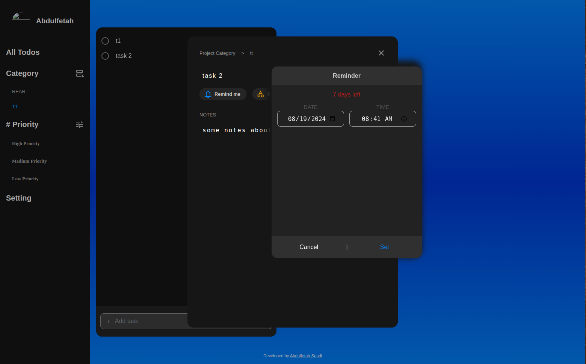

# Todo List App

Website: https://iamsuudi.github.io/to-do-list/

It's completely open at the moment, just run and try it out!

---

## Tech Stack

- **Front End:** HTML | JavaScript | CSS
- **Bundler:** Webpack
- **Storage:** LocalStorage
- **Other Libraries:** Sass, Data-fns

---

## Goal

My goal was to create an application where the user can practice speaking in a specific language with an AI. Why? Well I think it can be quite difficult to practice when you're not around a lot of native speakers. Travel can be expensive, and for introverts like me it might not be ideal at times.

---

## Key Features 

- View all projects.

- Create projects ( categories )

- View all todos in each project ( like the title, note and its duedate )

- Expand a single todo to see/edit its details.

- Marking a todo as completed

- Delete a todo.

---

## What I learned

1. Separating DOM related stuff from application logic.

2. Mastering webpack in and out and configuring it to own need.

3. Using embedded LocalStorage to store my data in the browser.

4. Using libraries like date-fns for date related stuff.

5. Using git subtrees to deploy github pages. 

6. Using JSON for data transportation.

7. I faced too much hard code repetition of DOM manipulations in vanilla javascript which I then created my own solution for it, which was setting up mini react-like class constructor which generates components for me on every instanciation.

8. Understaing what frameworks/libraries like react do for us under-the-hood.


---

## Project Images

**Landing Page**

This is the landing page for my web application. I added some cool hover effects to the info cards.



---

## Setup

Installation:

```bash
git clone git@github.com:iamsuudi/to-do-list.git
```
Install Dependencies:

```bash
npm install
```

Running Dev Server:

```bash
npm run dev
```

Running Prod Server:

```bash
npm run build
npm start
```
